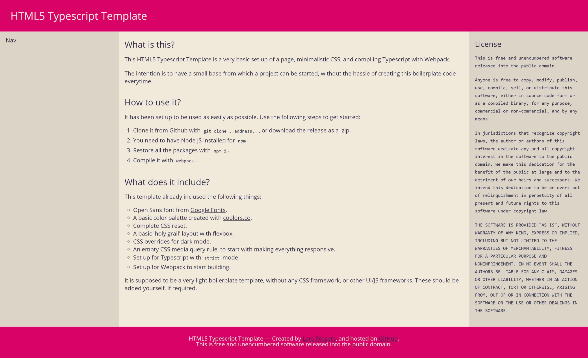
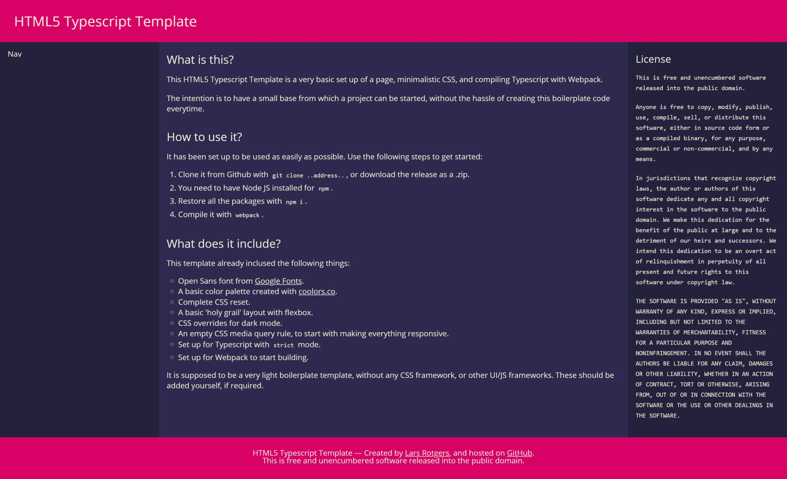

# Typescript Template

## What is this?

This HTML5 Typescript Template is a very basic set up of a page, minimalistic CSS, and compiling Typescript with Webpack.

The intention is to have a small base from which a project can be started, without the hassle of creating this boilerplate code everytime.

|Light|Dark|
|--|--|
|||

## How to use it?
It has been set up to be used as easily as possible. Use the following steps to get started:

  1. Clone it from Github with `git clone https://github.com/darkeclipz/html5-typescript-template`, or <a href="https://github.com/darkeclipz/html5-typescript-template/releases/download/v1.0.0/html5-typescript-template-v1.0.0.zip">download the release as a .zip</a>.
  2. You need to have Node JS installed for npm.
  3. Restore all the packages with `npm i --savedev`.
  4. Compile it with `webpack`.

## What does it include?
This template already inclused the following things:

  * Open Sans font from Google Fonts.
  * A basic color palette created with coolors.co.
  * Complete CSS reset.
  * A basic 'holy grail' layout with flexbox.
  * CSS overrides for dark mode.
  * An empty CSS media query rule, to start with making everything responsive.
  * Set up for Typescript with strict mode.
  * Set up for Webpack to start building.

It is supposed to be a very light boilerplate template, without any CSS framework,   or other UI/JS frameworks. These should be added yourself, if required.

# How to: only setup TS/Webpack

Steps required to recreate it. If Typescript `tsc` is not installed, this can be done with `npm i -g typescript`. If `npm` is not available, download Node JS.

### 1. Create `tsconfig.json`.

Creat a file `tsconfig.json` in the root directory of your project.
Add the following lines:

```json
{
  "compilerOptions": {
    "outDir": "./dist",
    "allowJs": false,
    "target": "es5",
    "allowUnusedLabels": false,
    "strict": true,
    "sourceMap": true
  },
  "include": ["./src/**/*"]
}
```

Or type `tsc --init` to create a new `tsconfig.json` file.

### 2. Set up webpack & building

Webpack dependencies can be installed with `npm install -savedev typescript webpack ts-loader source-map-loader`.

Then we create `webpack.config.js`, and paste:

```js
module.exports = {
  entry: "./src/index.ts",
  output: {
    filename: "./dist/bundle.js",
  },

  // Enable sourcemaps for debugging webpack's output.
  devtool: "source-map",

  resolve: {
    // Add '.ts' and '.tsx' as resolvable extensions.
    extensions: ["", ".webpack.js", ".web.js", ".ts", ".tsx", ".js"],
  },

  module: {
    rules: [
      // All files with a '.ts' or '.tsx' extension will be handled by 'ts-loader'.
      { test: /\.tsx?$/, loader: "ts-loader" },

      // All output '.js' files will have any sourcemaps re-processed by 'source-map-loader'.
      { test: /\.js$/, loader: "source-map-loader" },
    ],
  },

  // Other options...
};
```

Now we can build with `webpack`. To not have a minified source ouput, use

```js
optimization: {
    minimize: false
}
```

### 3. Other

 * To have Typescript output a source map, add `"sourceMap": true`.

For more information, see: https://www.typescriptlang.org/docs/handbook/migrating-from-javascript.html.